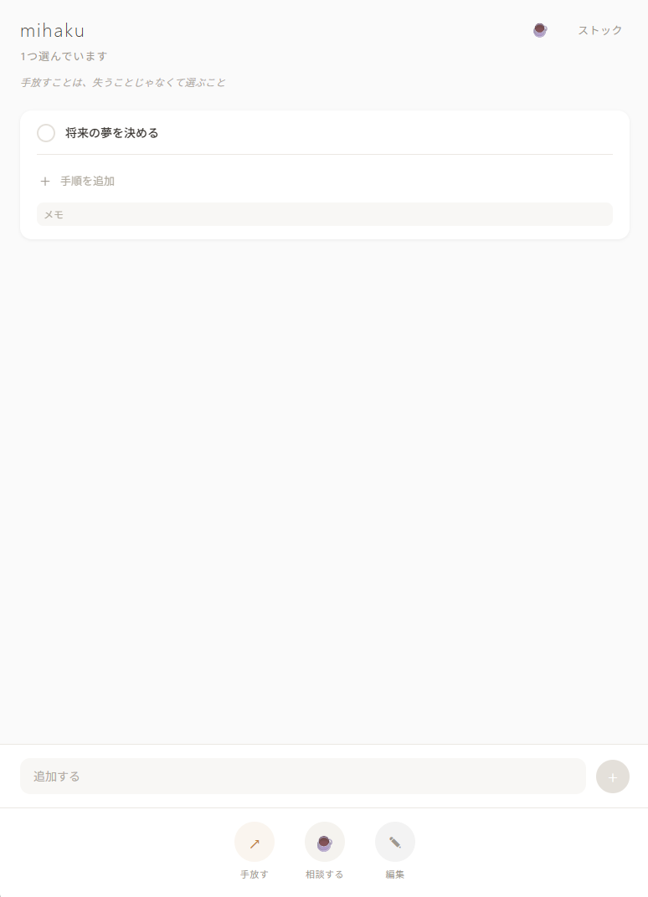

# mihaku（みはく）— プロダクト仕様書

> 最終更新: 2026-03-20

---

## 1. プロダクト概要

### 一言で

**「やらないことを決めて、自分の人生を取り戻すアプリ」**

### 名前の由来

mi（三）+ haku（白・余白）= 「3つの余白」。
3つに絞ることで生まれる余白。それがmihaku。

### ターゲット

タスクに追われている人。「もっとやれ」と言われ続けて、自分が何のために動いているか分からなくなった人。競争社会から離れて自分なりの日々を過ごしたい人にも、競争社会で戦い続けたい人にも対応する。

### 競合との違い

| アプリ | 思想 | mihakuとの違い |
|--------|------|--------------|
| Todoist | 「全部片づけろ」 | 量を減らさない |
| Motion | 「AIが最適スケジュールを組む」 | コントロールがAI側にある |
| Sunsama | 「やりすぎるな」 | 警告はするが「やめろ」とは言わない |
| **mihaku** | **「自分で選べ。やめていい。」** | **ユーザーにコントロールを返す** |

---

## 2. 設計哲学

### 3つの信念

1. **幸せは「コントロールの実感」から生まれる** — 自分で選んだ忙しさなら充足感がある
2. **「やめる」は「やる」より勇気がいる、だから価値がある** — 手放しは誇らしい選択
3. **答えは本人の中にある。AIは鏡であり、先生ではない** — 問いかけて気づきを促す。最終判断は常にユーザー

### AIの振る舞い

- 命令しない。問いかける
- 効率を求めない。「あなたらしいか」を問う
- 「やらなくていい」を恐れずに言う
- 最後の一言は常に「あなたはどうしたい？」

---

## 3. コア体験

### 毎日のフロー

```
はきだす → ふるう → すくう → みがく → きめる → ホーム
```

| ステップ | 名前 | 内容 | 担当 |
|---|---|---|---|
| 1 | **はきだす** | 頭の中を全部出す。音声入力メイン | ユーザー |
| 2 | **ふるう** | AIがミハクとクモにふるい分け。対話的に整形 | AI + ユーザー |
| 3 | **すくう** | 5人の相談役と一緒にミハクを選ぶ | 5人会議 Phase 1 |
| 4 | **みがく** | 選んだミハクを具体化・磨き上げる | 5人会議 Phase 2 |
| 5 | **きめる** | いつやるか決める。ワンタップ | ユーザー |

パンニング（砂金採り）の一連動作がメタファー。

### 用語

| 用語 | 意味 |
|---|---|
| **ミハク** | 今日これだけはやっておきたいもの。砂金。1日3つまで |
| **ヨハク** | 1-2つで「これでいい」と決めた状態。余白を選んだことの肯定 |
| **クモ（雲）** | 頭にあったけど今日は掴まなくていいもの。ストックに残る |
| **手放し** | ミハクに入れたものを意識的にやらないと決める行為。肯定的な選択 |

### 「今日の3つ」の設計

- 1日に選べるミハクは最大3つ（ワーキングメモリ容量・深い集中時間の科学的根拠に基づく）
- 1つでも2つでもOK（ヨハク）。数が少ない＝足りないではない
- 0個の日は何も起きない。アプリが反応しないのが正解
- 上限に達してもブロックしない。AIが問いかけるだけ

---

## 4. 5人の相談役

### キャラクター

ユーザーの迷いに対して5人の個性ある相談役が議論する。IFS（内的家族システム）に着想を得た設計。

| # | 名前 | 類型 | 意思決定上の役割 | 心理学的根拠 |
|---|---|---|---|---|
| 1 | **理央（りお）** | 頼れるお姉さん | 選択肢を広げる + 構造化 + Satisficing | WRAP「W」、Schwartz満足化理論 |
| 2 | **悠真（ゆうま）** | 穏やかな安心役 | 距離を取る + 緊急性バイアス指摘 | WRAP「A」、Mere Urgency Effect |
| 3 | **心春（こはる）** | 温かい本音引き出し役 | 本音を引き出す + 感情確認 | 動機づけ面接（MI）、Six Hats赤帽子 |
| 4 | **陽斗（はると）** | 正直なムードメーカー | 代替案提示 + 気持ち代弁 | WRAP「W」AND思考 |
| 5 | **凛（りん）** | 鋭い反論者 | 反証 + Pre-mortem | WRAP「R」、Pre-mortem |

- 心春と陽斗は兄妹（エンドコンテンツで解放）
- 凛は他4人の発言をインプットにして反論を生成する2段階方式
- キャラの口調は年齢帯（18-35歳）× 距離感（Phase 1-3）の2軸で可変

### 5人会議の2フェーズ

| | すくう（Phase 1） | みがく（Phase 2） |
|---|---|---|
| 目的 | 全体からミハクを選ぶ | 選んだミハクを具体化・磨く |
| 対象 | タスク全体のバランス | 個別タスクの深堀り |
| ホーム画面の「相談する」 | — | みがくと同じフォーマット |

### 実行意図の形成（きめる）

ミハク確定後に「いつやるか」をワンタップで設定。Gollwitzer & Sheeran (2006) のメタ分析で効果量d=0.65が確認されたImplementation Intentionsに基づく。

---

## 5. 初回体験

### 設計思想

ユーザーは最初から完璧なタスクを入力できない。全部吐き出してから選び取るプロセスを体感させる。5人会議を初回から体験させる（スキップ導線なし）。

### フロー

```
Step 1: はきだす
  「頭の中にあること、全部出してみてください」
  → 音声で一気に喋れる。テキストも可

Step 2: ふるう
  → AIがミハク候補とクモに分類
  → ドラッグで移動、音声/テキストで整形指示

Step 3: すくう
  → 5人がミハク候補を俯瞰してレビュー
  → 初回は心春が途中で自己紹介を聞く
  → ユーザーがミハクを選ぶ（3つまで）

Step 4: みがく
  → 選んだミハクを1つずつ具体化

Step 5: きめる
  → いつやるかワンタップ

Step 6: ホーム画面へ
```

---

## 6. 日替わりの一言

ホーム画面に毎日1つ、問いかけ・気づきの言葉を表示。幸福の科学の一転語のエッセンスをmihaku哲学に変換したもの。

### 8カテゴリ（全67件）

| カテゴリ | 内容 | 件数 |
|---|---|---|
| choice | 心の選択・自己信頼 | 7 |
| reflect | 内省・心の浄化 | 6 |
| reframe | 光転（逆境のリフレーミング） | 6 |
| gratitude | 感謝・今ここ | 5 |
| pace | 自分のペース | 6 |
| connect | 与える・つながり | 3 |
| margin | 選択と余白（mihakuコア） | 22 |
| drive | 前進・常勝（仕事系ユーザー向け） | 12 |

### パーソナライズ（v2）

ユーザーの行動パターン（ユーザータイプ）× 当日のコンディション（気分チェック等）で表示カテゴリの重みを調整。コンディションが低い日にdriveカテゴリは出さない。

---

## 7. 課金設計

### プラン構成（価格は暫定）

| | Free | Pro（680円/月） | Pro Max（1,480円/月） |
|---|---|---|---|
| 今日の3つ・手放し | ○ | ○ | ○ |
| 5人会議 | 初週無制限→1日1回 | 1日3回 | **無制限** |
| 会議中の発言 | 2回/会議 | 5回/会議 | **無制限** |
| AIそうだん | × | × | **○** |
| 1対1チャット | × | × | **○** |
| エンドコンテンツ | × | × | **○** |
| AIモデル | 標準 | 標準 | **高品質** |

### AIそうだん（Pro Max限定）

ホーム画面からいつでも音声/テキストでAIに操作・整形・相談を依頼できる常駐アシスタント。手動操作はProでも全て可能。

### プラン別の会議品質

| | Pro（方向性レベル） | Pro Max（具体的） |
|---|---|---|
| 理央 | 「偏ってるかも？」 | 「仕事3つで自分の時間ゼロ。入れ替えてみたら？」 |
| 悠真 | 「今日やった先に何がある？」 | 「先週も同じタスクをリスケしてる。今日片づけた方がいいかも」 |
| 心春 | 「一番気になるのはどれ？」 | 「先週は仕事ばっかりだったよね。自分の時間は？」 |
| 陽斗 | 「一部だけやる手もある」 | 「企画書、構成だけ先にやって本文は明日にしたら？」 |
| 凛 | 「本当にこの3つでいい？」 | 「ジム3日連続で抜いてるけど、意図的？」 |

### 自前APIキー

好きなAIモデルで無制限利用。mihaku側にAIコストが発生しない。パワーユーザー向け。

### 価格確定の方針

実装完了後、開発者自身がヘビーユーザーとして使い倒し、実際のAPIコストを計測してから確定する。

---

## 8. 画面イメージ

### ホーム画面（開発中）



- ヘッダー: アプリ名 + ☕（5人会議入口）+ ストック
- 日替わりの一言（ヘッダー下にイタリック表示）
- タスクカード: 展開するとサブタスク・メモが見える
- フローティングアクションバー: 手放す / 相談する / 編集
- 追加入力欄（3つ未満の時のみ表示）
- 余白は意図的なデザイン。mihakuのアイデンティティ

---

## 9. 技術スタック

| 項目 | 技術 |
|---|---|
| フレームワーク | React Native / Expo (SDK 55) |
| 言語 | TypeScript |
| ルーティング | expo-router |
| ローカルDB | expo-sqlite（ネイティブ）/ in-memory store（web） |
| アニメーション | react-native-reanimated |
| 音声入力 | expo-speech-recognition（予定） |
| ターゲット | iOS + Android |

---

## 10. 開発進捗

### イテレーション計画（全10段階）

| # | 名前 | 状態 |
|---|---|---|
| 1 | 骨格（expo-router, SQLite, テーマ） | ✅ 完了 |
| 2 | タスクの基本操作（追加, 表示, 完了, ストック） | ✅ 完了 |
| 3 | 手放し体験（アニメーション, 痕跡, ログ, モーダル） | ✅ 完了 |
| 4 | サブタスク + 筆リング（SVG, カード展開） | ✅ 完了 |
| 5 | はきだす（音声入力） | ⬜ 次 |
| 6 | ふるう（AI分類・対話的整形） | ⬜ |
| 7 | すくう・みがく（5人会議） | ⬜ |
| 8 | きめる + 朝の体験 | ⬜ |
| 9 | 初回体験（全フローの初回版） | ⬜ |
| 10 | 仕上げ（気分チェック, 課金, 設定, データ蓄積） | ⬜ |

### 実装済み機能

- ホーム画面（タスク表示・追加・完了・展開）
- タスクカードUI（筆セグメントリング / サブタスクなし時シンプルリング）
- サブタスク追加・チェック
- 手放しアニメーション（2s、ふわっと浮いて消える）
- カスタム確認モーダル
- 手放し痕跡（30%不透明度、画面下部、重なり表示）
- 手放しログ記録（release_logsテーブル）
- フローティングアクションバー（手放す / 相談する / 編集）
- 日替わりの一言（8カテゴリ67件）
- Web開発プレビュー（localhost:8081）

### DBスキーマ

```sql
tasks (id, title, status, memo, created_at, completed_at, released_at, selected_date, sort_order)
subtasks (id, task_id, title, completed, sort_order)
daily_logs (id, date, mood, note, created_at)
mood_checks (id, task_id, mood, action, created_at)
release_logs (id, task_id, task_title, reason, released_at)
```

---

## 11. 将来構想（v2以降）

- 鏡の週次/月次（Spotify Wrapped的な振り返り体験）
- カテゴリ（テーマの自動検出）
- ライフビジョン（Identity Statement）
- 1対1チャット + エンドコンテンツ（キャラの弱さ・関係性Level）
- 手放しサークル（匿名5人グループのコミュニティ）
- Google Calendar API連携
- クラウド同期

---

## 12. リポジトリ

- **コード**: `C:\ClaudeCode\projects\mihaku`（GitHub: akira1999work-debug/mihaku）
- **設計ドキュメント**: `C:\ClaudeCode\mihaku\CLAUDE.md`
- **キャラ設定**: `C:\ClaudeCode\mihaku\CHARACTER_SHEETS.md`
- **ブランチ**: `feat/v1-scaffold`
